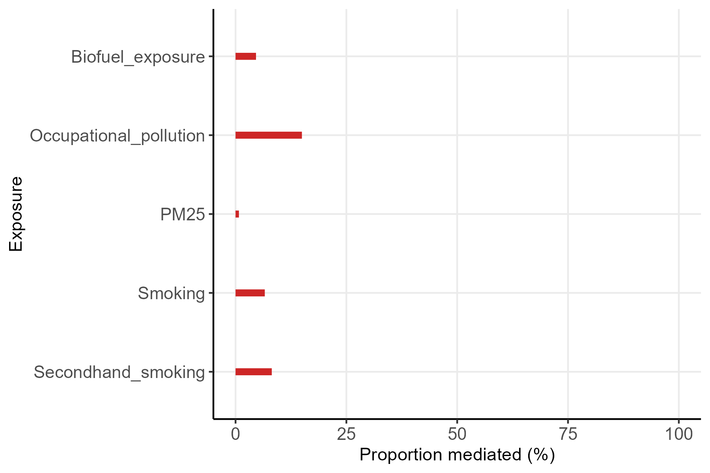

# Description

This repository builds upon the original [population_airway_microbiome repository](https://github.com/wangzlab/population_airway_microbiome). All original files have been preserved in the original structure of the repository and all new work has been created under the directory [mediation](/mediation), which contains a [power point presentation](mediation/2024-04-12_Seminar-Mediation-Javier.pptx) with a summary of the main criticisms raised after reviewing the [associated original research article](https://pubmed.ncbi.nlm.nih.gov/37349537/), which concern specifically to the mediation analyses reported in the paper.

# Procedure

I dowloaded supplementary table 3 of the article, in which the proportion of the effect mediated by microbial features is reported for different exposures. Unfortunately, the table does not specify which outcome was used for each estimate reported. Thus, I assumed that these refer to the same outcome.

Directed acyclic graphs (DAG) were reconstructed based on the assumptions reported in the research paper, followed by testing the assumptions in the DAG against the sample dataset provided by the authors of the paper in their github repository, and updated according to the procedure described by [Ankan, et al](https://doi.org/10.1002/cpz1.45). This was followed by estimating the proportion of the effect mediated in the sample dataset with inverse probability weighting, according to assumptions in the updated DAG, for all exposure-mediator-outcome relationships reported in the original paper (Figure 4e) with the "Airway microbiome health index" as the mediator of interest. Assessment of mediation through inverse probability weighting (IPW) allows to account for complex shared exposure-outcome and mediator-outcome relationships (see [paper by Martin Huber](https://onlinelibrary.wiley.com/doi/10.1002/jae.2341)).

# Main findings

1.  When selecting smoking as the exposure of interest, the total sum of proportion mediation was 3.836, which largely exceeds 1. Said in a different way, the total sum of proportion mediated should not be higher than 100%, but for smoking, mediation by microbial features is allegedly 383.6%.

2.  The authors report in the research article that their estimates for proportion mediation are "relatively robust" according to rho values in sensitivity analyses (rho = 0.117, sd = 0.027). Nonetheless, in the paper by [Chi et al](https://www.frontiersin.org/articles/10.3389/feduc.2022.886722/full), a rho value in *medsens* analyses is said to:

    > “ρ value is 0.1, indicating that the true ACME would not be significantly different from zero if there exist an unobserved confounder that causes a small correlation between errors for the mediator and the outcome models.”

This would suggest that the estimates are distant from being robust.

Lastly, reporting of the rho values should have been done in the table for every proportion mediated estimate, alongside its confidence interval. Pooling all rho values and reporting as the mean, SD does not allow to interpret robustness of individual estimates.

3.  Since these estimates are not robust as shown by sensitivity analyses, associations could be explained by residual exposure-outcome confounding, as shown and explained with the accompanying DAGs and the local test results showing that several of the conditional independencies do not hold in the sample dataset:

The assumptions in this DAG were updated to model with IPW. Here I show that after updating, the conditional independence assumption is consistent with the relationships found in the dataset:

4.  The models with the continuous mediator *AHMI* were modelled with inverse probability weighting to estimate the bootstrap 95% confidence interval of proportion mediated while accounting for shared exposure-outcome and mediator-outcome confounding, showing that the estimates provided in the paper could be exagerated. Furthermore, all confidence intervals include 0 which would mean that it is possible that none of the effect of exposures on respiratory health is mediated by the microbiome. These results are shown in the following plot:

These analyses could be reproduced in the complete dataset. Code would need to be adapted to account for the effect of district.
